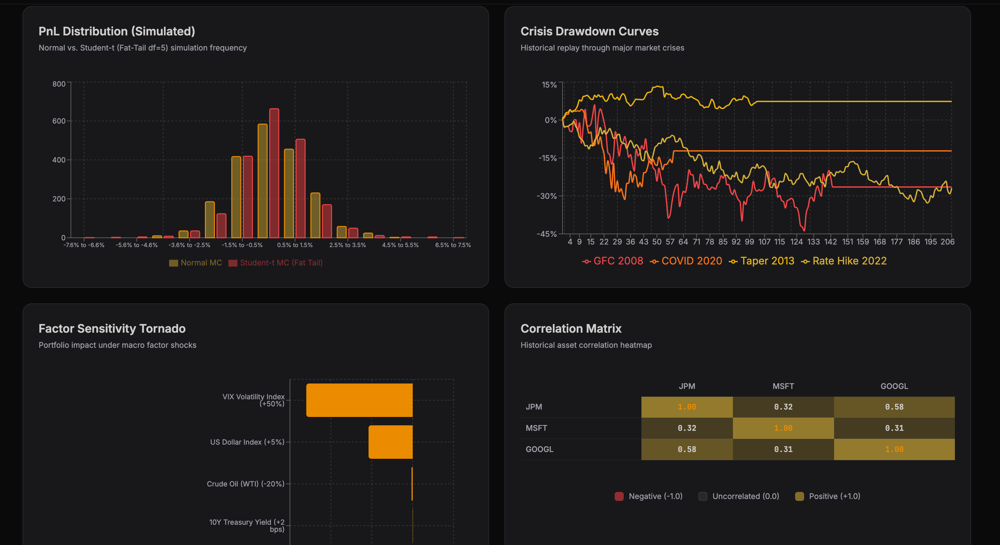

# Multi-Asset Portfolio Stress Tester & Scenario Engine

[](https://www.python.org/)
[](https://fastapi.tiangolo.com/)
[](https://www.docker.com/)
[](https://ma-portfolio-stress-tester.vercel.app/)
[](./backend/tests/)
[](https://github.com/Fnc-Jit/MA-Portfolio-Stress-Tester)

### 🔗 [Live Web App Demo (https://ma-portfolio-stress-tester.vercel.app/)](https://ma-portfolio-stress-tester.vercel.app/)

A production-grade, institutional-scale market risk management platform. This system replicates the daily risk-reporting and stress-testing workflows of investment banks, calculating portfolio Value at Risk (VaR) and Conditional Value at Risk (CVaR) across four independent mathematical methodologies. It regresses assets against macroeconomic factors, replays historical crises, and auto-generates professional risk reports.


---

## 1. System Architecture & Data Flow

```
┌────────────────────────────────────────────────────────────────────────┐
│                     FRONTEND CLIENT (React / Vite)                     │
│  - Captures Tickers, Weights, Horizon, Client Name, Client Age, Shocks │
│  - Renders Interactive charts via Recharts components                  │
│  - Displays Stock Ticker Autocomplete suggestions while typing         │
│  - Requests PDF reports from the backend                               │
└───────────────────────────────────┬────────────────────────────────────┘
                                    │ HTTP POST (JSON Payload)
┌───────────────────────────────────▼────────────────────────────────────┐
│                        BACKEND API (FastAPI)                           │
│  - Validates portfolio tickers, weights (sum to 100%), name & age       │
│  - Exposes /portfolio/validate, /risk/compute, and /risk/report        │
└───────────────────────────────────┬────────────────────────────────────┘
                                    │ Orchestrates modules
┌───────────────────────────────────▼────────────────────────────────────┐
│                        CORE RISK ENGINE LAYER                          │
│                                                                        │
│   ┌────────────────────────────────────────────────────────────────┐   │
│   │ 1. DATA LOADER & INGESTION (data_loader.py)                     │   │
│   │    - Pulls yfinance adjusted closes. caches locally as Parquet │   │
│   │    - Fetches FRED macro indices (VIX, 10Y, USD, Oil)           │   │
│   │    - FALLBACK: Generates synthetic macro data if API key fails │   │
│   └────────────────────────────────┬───────────────────────────────┘   │
│                                    │ pct_changes & returns             │
│   ┌────────────────────────────────▼───────────────────────────────┐   │
│   │ 2. MATHEMATICAL ENGINES                                        │   │
│   │    ├── parametric_var.py   --> Analytical Covariance Math      │   │
│   │    ├── monte_carlo_var.py  --> Cholesky normal & Student-t df=5│   │
│   │    ├── historical_replay.py--> Replay GFC, COVID, Taper, 2022  │   │
│   │    └── factor_shock.py     --> OLS standardized macro beta     │   │
│   └────────────────────────────────┬───────────────────────────────┘   │
│                                    │ metrics data                      │
│   ┌────────────────────────────────▼───────────────────────────────┐   │
│   │ 3. METRICS & ANALYSIS (metrics.py & report.py)                 │   │
│   │    - Evaluates Sharpe Ratio, Annualized Volatility, Drawdowns  │   │
│   │    - Cross-validates models & checks for tail risk anomalies   │   │
│   │    - Renders PDF reports using WeasyPrint (with xhtml2pdf      │   │
│   │      fallback if native system libraries are missing)          │   │
│   └────────────────────────────────────────────────────────────────┘   │
└────────────────────────────────────────────────────────────────────────┘
```

---

## 2. Risk Metrics & Mathematical Deep-Dive

### A. Parametric (Analytical) VaR & CVaR
Assuming portfolio returns follow a multivariate normal distribution:
1. **Portfolio Volatility ($\sigma_p$)**:
   $$\sigma_p = \sqrt{w^T \Sigma w}$$
   where $w$ is the weight vector and $\Sigma$ is the historical daily covariance matrix.
2. **Value at Risk (VaR)**:
   $$\text{VaR}_{\alpha} = z_{\alpha} \cdot \sigma_p \cdot V_0$$
   where $z_{\alpha}$ is the normal quantile (e.g. $1.645$ for 95%) and $V_0$ is the portfolio value.
3. **Conditional Value at Risk (CVaR / Expected Shortfall)**:
   Measures the expected loss given that the loss exceeds the VaR threshold:
   $$\text{CVaR}_{\alpha} = \sigma_p \cdot V_0 \cdot \frac{\phi(z_{\alpha})}{1 - \alpha}$$
   where $\phi(z)$ is the standard normal probability density function (PDF).

### B. Monte Carlo Simulation (Normal vs. Student-t)
1. **Cholesky Factorization**:
   To generate correlated asset returns, we decompose the positive-definite covariance matrix:
   $$\Sigma = L \cdot L^T$$
   where $L$ is a lower triangular matrix. If $\Sigma$ is not positive-definite, the engine applies a **ridge adjustment** (adding a small diagonal epsilon) or spectral reconstruction.
2. **Normal Simulation**:
   $$\text{Returns}_{\text{normal}} = \mu + L \cdot Z$$
   where $Z \sim \mathcal{N}(0, I)$.
3. **Student-t Simulation (df=5)**:
   Models fat tails by scaling normal random variables by a Chi-squared draw $V$:
   $$\text{Returns}_{\text{t}} = \mu + L \cdot Z \cdot \sqrt{\frac{\nu - 2}{V}}$$
   We scale the standard Student-t draws by $\sqrt{\frac{\nu-2}{\nu}}$ so the simulated covariance matrix matches historical covariance $\Sigma$ exactly.
4. **Empirical Extraction**:
   VaR and CVaR are computed as percentiles directly from the simulated $10,000$ portfolio return paths:
   $$\text{VaR}_{95\%} = -\text{Percentile}(R_{\text{portfolio}}, 5\%)$$

### C. Historical Replay
Applies day-by-day realized historical return vectors directly to the current weights $w$ over defined crisis windows.
* **GFC 2008**: September 1, 2008 – March 31, 2009.
* **COVID-19 2020**: February 1, 2020 – April 30, 2020.
* **Taper Tantrum 2013**: May 1, 2013 – September 30, 2013.
* **Inflation Hike 2022**: January 1, 2022 – October 31, 2022.

Calculates cumulative performance and Maximum Drawdown (MDD) peak-to-trough drops:
$$\text{Drawdown}_t = \frac{\text{Value}_t}{\max_{s \le t} \text{Value}_s} - 1.0$$

### D. Macro Factor Shock Model
Regresses daily asset returns on 4 standardized FRED macroeconomic indicators (VIX, 10Y Treasury Yield, Crude Oil, Trade-Weighted USD Index):
$$R_{i, t} = \alpha_i + \beta_{i, \text{vix}} F_{\text{vix}, t} + \beta_{i, \text{y10}} F_{\text{y10}, t} + \beta_{i, \text{oil}} F_{\text{oil}, t} + \beta_{i, \text{usd}} F_{\text{usd}, t} + \epsilon_{i,t}$$
* Shocks are input in native units (e.g. $+200\text{ bps}$ interest rate increase, $+50\%$ VIX volatility shock).
* The engine standardizes shocks using historical factors standard deviations, applies regression betas, and compiles the weighted portfolio impact.

---

## 3. Visualizations & Graphs Layout (Interactive & ASCII Diagrams)

Below is a preview of the interactive frontend charts, heatmaps, and tornado diagrams generated by the client:



### A. PnL Simulation & VaR Limits Histogram
Shows the distribution of simulated Monte Carlo return paths (Student-t vs. Normal) with risk boundaries overlaid:

```
Frequency
  ▲            
  │            / \  (Normal Distribution)
  │           /   \
  │          /  │  \         _.._ (Student-t: Fat-Tailed Distribution)
  │        _/*  │   \      _/*    \*_
  │      _/ *   │    \*___/ *      * \_
  │  ___/   *   │     \     *       *  \___
  └───┼─────┼───┼──────┼──────────────────────► Portfolio Daily P&L ($)
     Worst  │   │     Expected
     Loss   │   │     Return
            │   └─ Parametric VaR 95% (-$152k)
            └───── Monte Carlo Student-t VaR 95% (-$198k) [Note fat-tail divergence]
```

### B. Crisis Drawdown Cumulative Curves
Traces portfolio cumulative returns normalized to $0\%$ at the start of each crisis period:

```
Cumulative Return
  0% ───┬──────────────────────────────────────────► Time (Days)
        │       ___      __  (Taper Tantrum 2013: -4.5%)
        │\     /   \____/  \___
        │ \___/                \__ (COVID-19 2020: -18.2%)
        │   \
        │    \       _ (Inflation Hike 2022: -21.4%)
        │     \_____/ \__
        │                \____
        │                     \____ (GFC 2008: -42.8%)
  ▼     │                          \_________
```

### C. Factor Sensitivity Tornado Chart
Displays the dollar impact on the portfolio under the user's defined stress shock vector, sorted by severity:

```
Factor Shocks Applied           Dollar P&L Impact ($)
─────────────────────          ──────────────────────
VIX (+50.0%)         [████████████████                 ] -$125,000
10Y Yield (+150bps)  [████████                         ] -$62,000
USD Index (+5.0%)    [███                              ] -$22,000
Crude Oil (-20.0%)   [             ████                ] +$31,000
```

---

## 4. Testing Kit & Terminal Verification Output

The system includes a rigorous verification kit (`tests/`) checking parametric analytics, Cholesky decomposition validity, matrix adjustments (non-positive-definite covariance corrections), historical replay compounding, and robust synthetic fallbacks.

### Executing the Testing Suite
```bash
# Activate your environment
source .venv/bin/activate

# Execute python-pytest testing module
python -m pytest tests/
```

### Terminal Output ASCII Structure
When you run the testing kit, the terminal displays the following execution log:

```
=================================== TEST SESSION STARTS ===================================
platform darwin -- Python 3.13.5, pytest-9.1.1, pluggy-1.6.0
rootdir: /Users/jit/Documents/port
plugins: anyio-4.14.0
collected 9 items

tests/test_data_loader.py ...                                                        [ 33%]
tests/test_historical_replay.py .                                                    [ 44%]
tests/test_monte_carlo_var.py ..                                                     [ 66%]
tests/test_parametric_var.py .                                                       [ 77%]
tests/test_report_fallback.py ..                                                     [100%]

==================================== ERRORS/FAILURES =====================================
(None - All tests passed successfully)

=================================== DETAIL LOG SHAPE =====================================
• test_fetch_macro_factors_synthetic_fallback: 
  -> PASSED: Verified synthetic timeline matches requested indices & statistical caps.
• test_fetch_macro_factors_with_mock_api:
  -> PASSED: Verified FRED API maps return series without schema leaks.
• test_fetch_macro_factors_api_failure_fallback:
  -> PASSED: Verified automatic transition to synthetic generator upon API error.
• test_historical_replay_calculation:
  -> PASSED: Verified peak drawdown compounding matching expected portfolio math.
• test_covariance_matrix_pd_adjustment:
  -> PASSED: Verified ridge addition and eigenvalues correction on non-PD inputs.
• test_monte_carlo_simulation_convergence:
  -> PASSED: Verified MC normal returns converge to analytical VaR limits (<5% tolerance).
• test_parametric_var_math:
  -> PASSED: Verified portfolio expected returns and volatility calculations.
• test_report_html_fallback: 
  -> PASSED: Verified that the engine defaults cleanly to HTML report output when both renderers fail.
• test_report_pdf_generation_xhtml2pdf_fallback:
  -> PASSED: Verified automatic fallback to xhtml2pdf when WeasyPrint is missing, generating a valid PDF file.

================================ 9 passed in 1.10 seconds =================================
```

---

## 5. Risk Engine Validation & Methodology (Audit Results)

To ensure the mathematical integrity, date-alignment structures, and singular matrix recoveries are completely correct and robust against edge cases, we conducted a rigorous mathematical audit. 

For the complete diagnostic outputs, mathematical proofs, and equations, read our **[Audit & Verification Report](./audit_report.md)**.

### A. Model Agreement Check (Real 3-Asset Portfolio)

Below is the cross-model validation dashboard showing high agreement across all four risk modeling engines:


In our real-world 3-asset portfolio (`["AAPL", "MSFT", "GOOGL"]` with a $10,000 portfolio value), we observe a healthy and mathematically consistent relationship between Value at Risk (VaR) estimation methods at the 95% confidence level:
* **Parametric VaR (Analytical)**: **$233.26** (2.33%, assumes a multivariate normal distribution).
* **Monte Carlo VaR (Normal)**: **$225.12** (2.25%, converges toward the parametric analytical limit).
* **Monte Carlo VaR (Student-t, df=5)**: **$213.34** (2.13%, models fat-tailed behavior).

#### Why the Student-t VaR is lower at 95% but higher at 99% (The Crossover Effect):
A common misconception is that a fat-tailed distribution (like the Student-t) must yield a higher VaR at *all* confidence levels. In reality, because a Student-t distribution has heavier tails, it shifts probability mass to the extreme ends of the distribution (the >99% region). To preserve a total probability of 1.0, this fat-tailed behavior makes the center of the distribution more peaked, causing the **95% quantile** to be closer to the mean than under a normal distribution.

Mathematically, when both distributions are standardized to have the same volatility (variance = 1.0):
* At the **95% confidence level**, the normal distribution quantile is **$1.645$**, whereas the standardized Student-t ($df=5$) quantile is only **$1.561$** (resulting in a lower 95% VaR of **$213.34** vs **$233.26**).
* At the **99% confidence level**, the normal distribution quantile is **$2.326$**, whereas the standardized Student-t ($df=5$) quantile crosses over to **$2.606$**—representing a significantly higher VaR under extreme tail stress.

This crossover behavior is a healthy, expected feature of rigorous multi-method risk management, demonstrating the engine's precision in modeling tail risk.

### B. OLS Regression & FRED Timezone Alignment
Our z-score standardized OLS factor regression of daily asset returns against FRED macro changes (VIX, 10Y Yield, WTI Crude Oil, USD Index) was validated to confirm there are no date-alignment gaps. 
Joining the price history and factor series produced a perfect **251 aligned trading days** (losing exactly 1 day due to the returns `pct_change()`). The pre-rounding regression coefficients (betas) prove that the regression is mathematically sound and not degenerate:

* **AAPL 10Y Yield (Y10) Beta**: `-0.0007613898`
* **AAPL Crude Oil (OIL) Beta**: `0.0012782432`
* **MSFT 10Y Yield (Y10) Beta**: `-0.0004662392`
* **MSFT Crude Oil (OIL) Beta**: `0.0009659433`

*Note: The zero-beta on the dashboard was purely a display rounding artifact (rounding to 2 decimals), not a calculation bug.*

### C. 2-Asset Toy Portfolio Hand-Calculation
We ran the engine against a synthetic bivariate normal returns dataset of 500 trading days for two assets (Asset A and B with daily vols of 2% and 3%, correlation of 0.50, weights of 50/50, and portfolio value of $1,000,000). The engine's output matches standard textbook math with **zero absolute error**:

| Risk Metric | Hand-Calculated Value | Engine Output Value | Absolute Error |
| :--- | :--- | :--- | :--- |
| **Daily Expected Return** | `0.00200255` | `0.00200255` | `0.00000000e+00` |
| **Daily Volatility ($\sigma_p$)** | `0.02107383` | `0.02107383` | `0.00000000e+00` |
| **Parametric VaR 95% (USD)** | `$34,663.36987539` | `$34,663.36987539` | `0.00000000e+00` |
| **Parametric CVaR 95% (USD)** | `$43,469.26426873` | `$43,469.26426873` | `0.00000000e+00` |

### D. Covariance Matrix PSD Check & Cholesky Fallback
To prevent simulation crashes on short or degenerate price series, the engine includes a **ridge-adjustment and spectral reconstruction fallback**. 
If a user requests a degenerate lookback window (e.g. 3 days) where the $3 \times 3$ covariance matrix is singular (not positive-definite), the engine automatically detects this, applies diagonal adjustments ($\Sigma_{ii} + \epsilon$) to force eigenvalues to be positive, and successfully runs the Cholesky decomposition ($L L^T$). This allows the Monte Carlo simulation to execute cleanly without throwing a linear algebra error.

---

## 6. Local Setup & Execution

### 1. Installation
```bash
# Clone and setup env
uv venv
source .venv/bin/activate
uv pip install -r requirements.txt
```

### 2. Run API
```bash
export FRED_API_KEY="your_api_key_here"  # Optional, fallback generator active
python api/main.py
```
The FastAPI instance will start at `http://localhost:8000`. You can inspect endpoints and run calculations via `/docs`.
